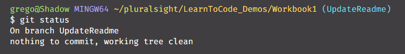
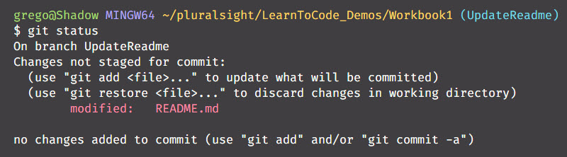

# Workbook 1 - Git Setup

Setup your Git configuration with the following settings.

Open your Git Bash terminal if you are on a PC, or iTerm if you are on a mac. Enter the following commands

```bash
git config --global user.name "Your Name"
git config --global user.email "your@email.com"

git config --global core.editor "code --wait"
```

The last command will set VSCode as your default git editor for commit messages or merge conflict resolution. This will greatly simplify your life while working with git.

## Git workflow

Ensure that your branch is all up to date.

```bash
git status
```
If it **IS** up to date you can continue.



If it is **NOT** up to date you must stage and commit changes.



_Don't create a branch when you have uncommitted changes._
```bash
# 1. create a new Feature branch
git branch TaskName
git checkout TaskName # this switches branches

# 2. make your code changes and commit
git add -A # stage your changes
git commit -m "your message" # commits your changes

# 3. merge changes into main and push
git checkout main
git merge TaskName
git push # pushes your to GitHub

# 4. delete the Feature Branch
git branch delete TaskName

```
